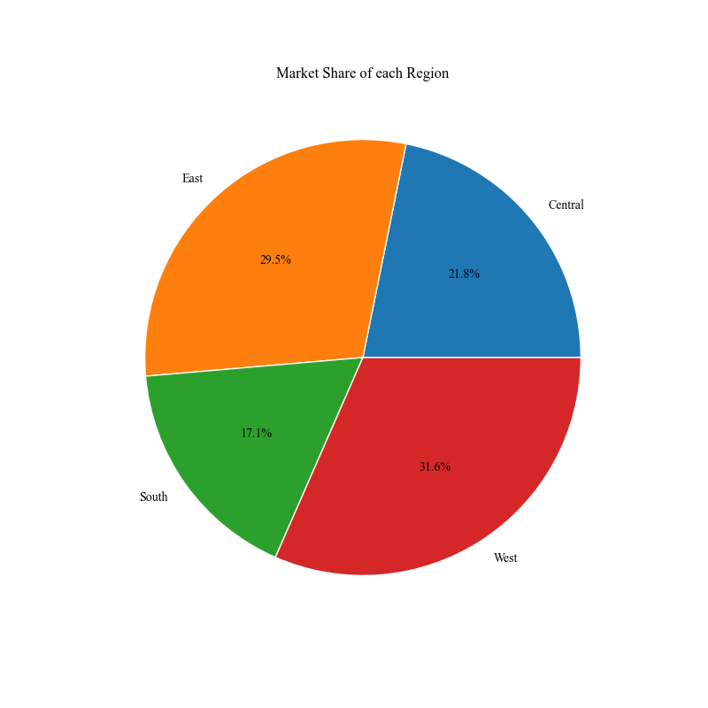

# Superstore Pro-Analytics Dashboard

**Author: Nikhil Singh**


---

## 📋 Project Overview

This project transforms a raw Superstore dataset into a powerful, interactive analytics dashboard using Streamlit. It moves beyond static reports to provide a hands-on tool for exploring sales trends, regional performance, and product profitability. The application is designed for stakeholders like store managers and sales teams to make informed, data-driven decisions.

---

## 🚀 Key Visualizations

A gallery of the core insights derived from the data analysis, showcasing performance across different business dimensions.

<table align="center">
  <tr>
    <td align="center"><strong>Sales Performance by Region</strong></td>
    <td align="center"><strong>Profit Performance by Region</strong></td>
  </tr>
  <tr>
    <td></td>
    <td></td>
  </tr>
  <tr>
    <td align="center"><strong>Sales vs. Profit Relationship</strong></td>
    <td align="center"><strong>Market Share by Region</strong></td>
  </tr>
  <tr>
    <td></td>
    <td></td>
  </tr>
    <tr>
    <td align="center"><strong>Top 5 Most Profitable Sub-Categories</strong></td>
    <td align="center"><strong>Top 5 Least Profitable Sub-Categories</strong></td>
  </tr>
  <tr>
    <td></td>
    <td></td>
  </tr>
</table>

---

## ✨ Core Features

* **📈 Executive Dashboard:** An at-a-glance summary of critical KPIs like total sales, profit, and overall profit margin.
* **🗺️ Geospatial Analysis:** An interactive map of the U.S. to visualize sales and profit distribution by state, identifying high-performing and underperforming regions.
* **📊 Deep-Dive Explorer:** A tool for users to filter the dataset by region and category, enabling investigation into specific trends with custom visualizations.
* **💡 Profit Simulator:** A "what-if" analysis tool powered by a Random Forest model. It allows users to adjust variables like sales price and discount to see the predicted impact on profitability.

---

## 🛠️ Technology Stack

* **Programming Language:** Python
* **Data Manipulation & Analysis:** Pandas, NumPy
* **Interactive Web Framework:** Streamlit
* **Data Visualization:** Plotly Express, Matplotlib, Seaborn
* **Machine Learning:** Scikit-learn
* **Initial Exploration:** Jupyter Notebook

---

## 📂 Project Structure

```
Superstore-Analytics/
│
├── data/
│   └── superstore-us.csv
│
├── notebooks/
│   └── superstore-analytics.ipynb
│
├── plots/
│   ├── sales_by_region.png
│   └── (all other plot images)
│
├── app.py
├── simulator.py
├── README.md
└── requirements.txt
```

---

## ⚙️ Local Setup and Installation

To run this project on your local machine, follow these steps:

1.  **Clone the Repository:**
    ```bash
    git clone [https://github.com/Nikhil-1920/superstore-analytics-dashboard.git](https://github.com/Nikhil-1920/superstore-analytics-dashboard.git)
    cd superstore-analytics-dashboard
    ```

2.  **Set Up a Virtual Environment:**
    ```bash
    python3 -m venv venv
    source venv/bin/activate
    ```

3.  **Install Dependencies:**
    ```bash
    pip install -r requirements.txt
    ```

4.  **Run the Streamlit App:**
    ```bash
    streamlit run app.py
    ```
    The application will automatically open in your web browser.

---

